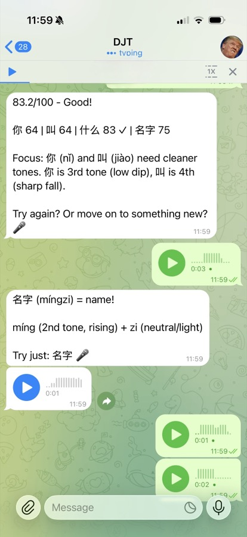
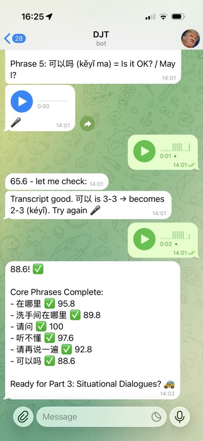

# xuezh (Chinese Learning Engine, ZFC / Unix-style)

Name: **xuezh** is short for **学中文** (learn Chinese).

This repo is a **local learning engine** for Mandarin study. It is designed to be used as a **tool/skill** behind a bot runtime + SOTA LLM (Clawdis is the recommended integration), but it is also a plain **CLI** you can call however you want.

## Authorship

Primary author: **Codex** using the **gpt-5.2-codex** model.

## Recommended usage (Clawdis)
**Recommended**: run `xuezh` as a CLI tool from a bot agent (Clawdis) and parse JSON outputs.  
Use a config file for credentials/behavior, and keep dependencies pinned in the bot's dev environment.  
You will need an Azure Speech key + region (free tier is fine to start).

Clawdis (upstream) repo:
```
https://github.com/steipete/clawdis
```
Clawdis is a local-first personal assistant that routes WhatsApp/Telegram/WebChat messages to an agent runtime.
The Gateway is the control plane (sessions, providers, media, voice wake), while tools like `xuezh` are called on demand.
Integration is simple: have the bot call the `xuezh` CLI and parse JSON responses, then surface the feedback back to the user.
You can run the bot locally on your devices and keep all state under your control.

Key interaction flows (bot ↔ user):

1) **Pronunciation feedback (audio → assessment)**  
   User sends a voice note (e.g., “你好我叫小李。你叫什么？”).  
   Bot calls:
   
   ```text
   xuezh audio process-voice --in /tmp/voice.m4a --ref-text "你好我叫小李。你叫什么？" --json
   ```
   Bot reads `data.assessment` + `data.transcript` and responds with targeted feedback.

2) **Listen and repeat (text → audio)**  
   User asks “How do I say …?”  
   Bot calls:
   
   ```text
   xuezh audio tts --text "你好" --json
   ```
   Bot returns the `audio_tts` artifact as a voice note.

3) **Progress recap (facts → summary)**  
   User asks “How am I doing?”  
   Bot calls:
   
   ```text
   xuezh report hsk --level 6 --json
   ```
   Bot summarizes the factual progress data.

Example screenshots (from a bot flow):

<table>
  <tr>
    <td></td>
    <td></td>
  </tr>
  <tr>
    <td></td>
    <td></td>
  </tr>
</table>

Example config (`~/.config/xuezh/config.toml`):
```toml
[azure.speech]
key_file = "/run/agenix/xuezh-azure-speech-key"
region = "westeurope"

[audio]
backend_global = "azure.speech"
process_voice_backend = "azure.speech"
convert_backend = "ffmpeg"
tts_backend = "edge-tts"
inline_max_bytes = 200000
```

## Other usage (CLI)
This is a standard CLI. You can call it from any script or workflow as long as its dependencies are available:
```text
xuezh version --json
xuezh audio process-voice --in /path/to/voice.m4a --ref-text "你好" --json
```

## Core commands + example outputs

Version:
```text
$ xuezh version --json
{"ok":true,"schema_version":"1.0","command":"version","data":{"version":"0.1.0"},"artifacts":[],"truncated":false,"limits":{}}
```

Voice processing (pronunciation assessment + transcript):
```text
$ xuezh audio process-voice --in /path/to/voice.m4a --ref-text "你好" --json
{"ok":true,"schema_version":"1.0","command":"audio.process-voice","data":{"assessment":{...},"transcript":{"text":"你好"}},"artifacts":[...],"truncated":false,"limits":{"inline_bytes_max":200000}}
```

Text-to-speech (audio artifact):
```text
$ xuezh audio tts --text "你好" --json
{"ok":true,"schema_version":"1.0","command":"audio.tts","data":{"voice":"zh-CN-XiaoxiaoNeural"},"artifacts":[{"purpose":"audio_tts","path":"artifacts/audio/tts/....wav"}],"truncated":false,"limits":{}}
```

## Key idea

- **Model = smart endpoint** (lesson planning, choosing what to teach next, pedagogy)
- **Engine = dumb pipes** (SQLite persistence, mechanical transforms, bounded reports, audio file materialization)

The engine must remain **ZFC-compliant**: no local ranking/selection heuristics; no “what should we do next” logic. The engine only returns primary sources and performs mechanical transforms. See `docs/reference/zfc-zero-framework-cognition.md`.

## Audio pipeline architecture (STT/TTS)

**Input normalization:** all audio is normalized to WAV via `ffmpeg` before any backend call.  
**STT / assessment:** `audio.process-voice` runs STT + pronunciation assessment (default backend is Azure Speech).  
**Artifacts:** full raw outputs are stored as artifacts; the CLI response inlines only the actionable subset.  
**TTS:** `audio.tts` uses `edge-tts` to materialize voice audio into an artifact.  
**Local fallback:** `whisper` provides a local STT path when Azure isn't used.

## Runtime dependencies
- `ffmpeg` (audio conversion)
- `edge-tts` (TTS voice)
- `whisper` (local STT fallback; Azure is default)
- Azure Speech SDK + credentials for pronunciation assessment

Azure notes:
- You need an Azure Speech resource key/region (free F0 tier is fine to start).
- Quick setup:
  1) Create an Azure Speech resource (region `westeurope` is fine).
  2) Grab the key + region from the Azure portal.
  3) Put the key in your config file (`[azure.speech] key_file = ...`) and set `region`.
  4) Run `xuezh audio process-voice --in /path/to/audio.m4a --ref-text "你好" --json`.
- Free tier includes 5 audio hours/month for Speech to Text and 0.5M Neural TTS characters/month.
- Pronunciation Assessment is billed at the baseline Speech to Text rate; prosody/grammar/vocabulary/topic are add-on charges.

## Quick start (developer)

1) Enter the dev environment:
   ```bash
   devenv shell
   ```

2) (Optional) Install the package in editable mode:
   ```bash
   python -m pip install -e .[dev]
   ```

3) Run the CLI:
   ```bash
   xuezh --help
   xuezh version --json
   ```

4) Run tests:
   ```bash
   pytest
   ```

## What’s included

- `schemas/` : JSON Schemas (contract stubs; to be enforced by tickets)
- `tests/fixtures/` : minimal dataset fixtures
- `src/xuezh/` : Python package + CLI skeleton (`xuezh`)
- `tickets/` : implementation tickets (Beads source of truth)
- `specs/` : user requirements, BDD scenarios, and testing pyramid strategy
- `skills/chinese-learning-orchestrator/` : the Skill prompt glue (SKILL.md + references)
- `devenv.nix` : dev environment skeleton (use this; do **not** install via global package managers)
- `docs/handoff/` : handoff prompt for the implementing agent
- `infra/azure/speech/` : OpenTofu scaffold for the Azure Speech resource

## Project boundaries (important)

- This repo **does not** implement the Clawdis bot runtime/Gateway or any Telegram/WhatsApp/WebChat integration.
- This repo **does not** implement pedagogy, recommendations, or personalization logic (that stays in the model/agent).
- The skill (`skills/.../SKILL.md`) teaches the model *how to use the engine*, and encodes learning best practices.

## Workspace / data path

The engine stores data under:

- `~/.clawdis/workspace/xuezh/`

Override via environment variables:
- `XUEZH_WORKSPACE_DIR`
- `XUEZH_DB_PATH`

## Ticket execution method

Work items live in Beads (not `tickets/`; those were scaffold placeholders).  
Implement tickets using the **RGR pattern**:
- **Red:** write/enable tests
- **Green:** minimal implementation to pass tests
- **Refactor:** clean up without behavior change

See `AGENTS.md`.

---

## References

- Authoritative CLI spec: `docs/cli-contract.md`
- Documentation map: `docs/README.md`
- Out of scope (v1): `specs/out-of-scope.md`
- Authoritative specs: `specs/id-scheme.md`, `specs/events.md`, `specs/artifacts/retention.md`
- CI-style checks: `./scripts/check.sh`
- Contract coverage enforcement: `tests/contract/`
